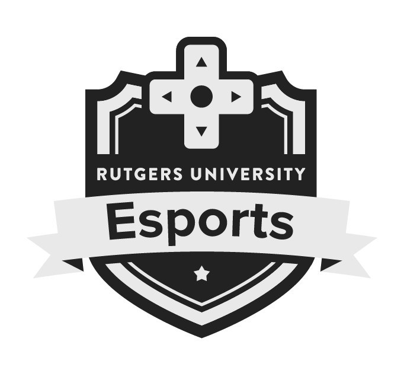

<!-- PROJECT LOGO -->
 

  

  <h3 align="center">Rutgers Esports Newsletter App</h3>
  

    <a href="https://rutgers-esports-mailing-list.herokuapp.com/"><strong>View the site here! »</strong></a>
     
  

<!-- TABLE OF CONTENTS -->

  
Table of Contents

  <ol>
    <li>
      <a href="#about-the-project">About The Project</a>
      <ul>
        <li><a href="#built-with">Built With</a></li>
      </ul>
    </li>
    <li><a href="#license">License</a></li>
    <li><a href="#contact">Contact</a></li>
    <li><a href="#acknowledgements">Acknowledgements</a></li>
  </ol>

<!-- ABOUT THE PROJECT -->
## About The Project

  

A simple web application for the Rutgers Esports newsletter sign-up.

Details
* Developing based on the [Web Developer Bootcamp](https://www.udemy.com/share/1013gG/) course.
* My first server-side web-app, which provides intuition on how the front-end and back-end interact.
* Interacting with the [MailChimp API](https://mailchimp.com/developer/) using a POST request form.
* Hosting on [Heroku](https://www.heroku.com/).

### Built With

* [Bootstrap](https://getbootstrap.com)
* [Node.js](https://nodejs.org)
* [Express](https://expressjs.com)
* [Heroku](https://www.heroku.com/)

<!-- CONTRIBUTING -->
## Contributing

Contributions are what make the open source community such an amazing place to be learn, inspire, and create. Any contributions you make are **greatly appreciated**.

1. Fork the Project
2. Create your Feature Branch (`git checkout -b feature/AmazingFeature`)
3. Commit your Changes (`git commit -m 'Add some AmazingFeature'`)
4. Push to the Branch (`git push origin feature/AmazingFeature`)
5. Open a Pull Request

<!-- LICENSE -->
## License

Distributed under the MIT License. See `LICENSE` for more information.

<!-- CONTACT -->
## Contact

Mueez Khan - [@mueezkhan_](https://twitter.com/mueezkhan_)

Project Link: [https://github.com/rzmk/Rutgers-Esports-Newsletter-App](https://github.com/rzmk/Rutgers-Esports-Newsletter-App)

<!-- ACKNOWLEDGEMENTS -->
## Acknowledgements
* [The Complete Web Development Bootcamp](https://www.udemy.com/share/1013gG/)
* [Best-README-Template](https://github.com/othneildrew/Best-README-Template)
* [MailChimp API](https://mailchimp.com/developer/)

